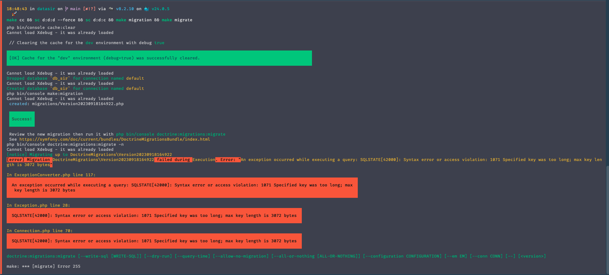

# Base de données du SIR

Ce document explique la problématique rencontrée et la procédure à appliquer pour résoudre le problème.

## Problème

Le SIR dispose d'une base de données dite "morte", cette base de données est utilisée pour la génération des fichiers de 
configuration du SIR. Cette base de données était utilisée par le SIR pour la création  et pour la consultation des 
données.
Cette base étant "morte" les données ne pouvaient pas être modifiées, il était donc nécessaire de créer une nouvelle base
de données pour la gestion des données du SIR tout en conservant la base de données "morte" qui est probablement une base 
nationale. <br>
<strong>Comment recréer une base de données à partir d'un fichier d'une base de données existant</strong>

## Le fichier de base de données

Le fichier pèse environ 18Mo, pour des raisons de confidentialité, il ne sera pas partagé sur ce dépôt. Le fichier de Migration
permet tout de même de comprendre la structure de la base de données.

--- 

# Etape 1: Création des entités

Les entités sont des classes PHP qui permettent de représenter les tables de la base de données. Pour créer les entités,
à partir du fichier SQLite existant, il faut utiliser la commande suivante :

```bash
php bin/console doctrine:mapping:import "App\Entity" annotation --path=src/Entity
```

Cette commande est sympa mais elle comporte quelques problèmes :
- Elle ne permet pas de gérer les attributs, ici les annotations sont utilisées.
- Elle ne permet pas de gérer les relations entre les entités.

> A cette étape et compte tenu du résultat obtenu, je vais supprimer les entités générées par la commande précédente.

# Etape 2: Transformer les annotations en attributs

Pour transformer les annotations en attributs, j'ai utilisé la librairie `Rector`, pour ce faire, il faut installer la 
librairie :

```bash
composer require rector/rector --dev
```

Ensuite, il faut créer un fichier de configuration `rector.php` à la racine du projet :

```bash
touch rector.php
```

Ensuite, il faut ajouter le code suivant dans le fichier `rector.php` :

```php
<?php

declare(strict_types=1);

use Rector\Config\RectorConfig;
use Rector\Doctrine\Set\DoctrineSetList;
use Rector\Symfony\Set\SensiolabsSetList;
use Rector\Symfony\Set\SymfonySetList;

return static function (RectorConfig $rectorConfig): void {
    $rectorConfig->sets(sets: [
        DoctrineSetList::ANNOTATIONS_TO_ATTRIBUTES,
        SymfonySetList::ANNOTATIONS_TO_ATTRIBUTES,
        SensiolabsSetList::ANNOTATIONS_TO_ATTRIBUTES,
    ]);
};
```

Maintenant que cela est fait, il faut exécuter la commande suivante :

```bash
php bin/console make:entity --regenerate "App\Entity"
```

Maintenant, il faut lancer le commande de `Rector` pour obtenir les attributs :

```bash
php vendor/bin/rector process src/Entity --config rector.php
```

Maintenant j'ai bien mes entités avec les attributs. Il faut faire un peu de travail dans les classes, voici
les modifications à apporter :

- Supprimer les `annotations` inutiles
- Ajouter les `getters et setters` pour les propriétés (Etape 3)
- Ajouter les `repository` pour les entités
- Ajouter les `types` pour les propriétés

Pour les `repository`, il faut ajouter le code suivant l'attribut `#[ORM\Entity(repositoryClass: <className>Repository::class)]`

Exemple pour l'entité `AccessoireSecurite` :

```php
#[ORM\Table(name: 'ACCESSOIRE_SECURITE')]
#[ORM\Index(columns: ['RF', 'ID_ESP_DIRECTEUR'], name: 'IndexAccSec1')]
#[ORM\Entity(repositoryClass: AccessoireSecuriteRepository::class)]
class AccessoireSecurite
{
 // ...
}
```

Maintenant, il faut créer les `repository` pour les entités, pour ce faire, il n'existe pas de commande, mon IDE 
(PhpStorm) me permet de le faire facilement. Mais voici ce qu'il faut faire :

- Créer un dossier `Repository` dans le dossier `src/`
- Créer un fichier `<className>Repository.php` dans le dossier `src/Repository`
- Ajouter le code suivant dans le fichier `<className>Repository.php` :

```php
<?php

namespace App\Repository;

use App\Entity\<className>;
use Doctrine\Bundle\DoctrineBundle\Repository\ServiceEntityRepository;
use Doctrine\Persistence\ManagerRegistry;

/**
 * @method <className>|null find($id, $lockMode = null, $lockVersion = null)
 * @method <className>|null findOneBy(array $criteria, array $orderBy = null)
 * @method <className>[]    findAll()
 * @method <className>[]    findBy(array $criteria, array $orderBy = null, $limit = null, $offset = null)
 */
class <className>Repository extends ServiceEntityRepository
{
    public function __construct(ManagerRegistry $registry)
    {
        parent::__construct($registry, <className>::class);
    }
}
```

> Remplacer `<className>` par le nom de la classe

# Etape 3: Ajouter les getters et setters

Pour ajouter les getters et setters, il faut exécuter la commande suivante :

```bash
php bin/console make:entity --regenerate "App\Entity"
```
Cette commande peut prendre plus ou moins de temps en fonction du nombre d'entités à traiter.


---


# Gestion des clés d'index dans la migration Symfony

## Problème
Lorsque j'exécute les migrations Symfony, j'obtiens l'erreur suivante :



## Solution
La solution consiste à ajouter des contraintes de longueur aux colonnes d'index pour limiter la longueur des clés.
Dans le cas présent j'ai appliqué une longueur de 191 caractères à chaque fois que cela était nécessaire.

### Modifications requises
Dans chaque migration concernée, vous devez ajouter des contraintes de longueur aux colonnes d'index. Voici les modifications spécifiques à apporter :

- Dans la migration correspondant à la table `ACCESSOIRE_SECURITE`, nous avons ajouté une contrainte de longueur sur la colonne `RF` pour limiter sa longueur à 191 caractères :

    ```sql
    ACCESSOIRE_SECURITE => INDEX IndexAccSec1 (RF(191), ID_ESP_DIRECTEUR)
    ```

- Dans la migration correspondant à la table `ACCESSOIRE_SOUS_PRESSION`, nous avons ajouté une contrainte de longueur sur la colonne `RF` :

    ```sql
    ACCESSOIRE_SOUS_PRESSION => INDEX IndexAccPres1 (RF(191), ID_ESP)
    ```

- Dans la migration correspondant à la table `ENSEMBLE_OU_FONCTION`, nous avons ajouté une contrainte de longueur sur la colonne `RF` :

    ```sql
    ENSEMBLE_OU_FONCTION => INDEX IndexEnsFct2 (RF(191))
    ```

- Dans la migration correspondant à la table `ENSEMBLE_OU_FONCTION`, nous avons ajouté une contrainte de longueur sur la colonne `RF` :

    ```sql
    ENSEMBLE_OU_FONCTION => INDEX IndexEnsFct1 (TYPE_ENSEMBLE_OU_FONCTION, RF(191))
    ```

- Dans la migration correspondant à la table `ESP`, nous avons ajouté une contrainte de longueur sur la colonne `RF` :

    ```sql
    ESP => INDEX IndexEsp1 (RF(191), BLN_ESPDIRECTEUR)
    ```

- Dans la migration correspondant à la table `HISTORIQUE`, nous avons ajouté une contrainte de longueur sur la colonne `REFERENCE_DOCUMENT` :

    ```sql
    HISTORIQUE => INDEX IndexHisto2 (ID_ESP, REFERENCE_DOCUMENT(191))
    ```

- Dans la migration correspondant à la table `PLAN`, nous avons ajouté une contrainte de longueur sur la colonne `RF_OBJET_ASSOCIE` :

    ```sql
    PLAN => INDEX IndexPlan1 (RF_OBJET_ASSOCIE(191), BLN_AVEC_ZS)
    ```

- Dans la migration correspondant à la table `UTILISATEURS`, nous avons ajouté une contrainte de longueur sur la colonne `IDENTIFIANT` :

    ```sql
    UTILISATEURS => INDEX IndexUser1 (IDENTIFIANT(191), PROFIL)
    ```
  
Ce qui donne au final pour la table `ACCESSOIRE_SECURITE` :

```sql
        $this->addSql(sql: 'CREATE TABLE ACCESSOIRE_SECURITE (
            id INT AUTO_INCREMENT NOT NULL,
            RF LONGTEXT DEFAULT NULL,
            TYPE_ACC_SECU LONGTEXT DEFAULT NULL,
            CATEGORIE_RISQUE LONGTEXT DEFAULT NULL,
            PRESSION_TARAGE LONGTEXT DEFAULT NULL,
            CARACTERISTIQUE LONGTEXT DEFAULT NULL,
            FLUIDE_CONTOLE LONGTEXT DEFAULT NULL,
            FABRICANT LONGTEXT DEFAULT NULL,
            TYPE_NR_FABRICATION LONGTEXT DEFAULT NULL,
            BLN_TARAGE_RP INT DEFAULT NULL,
            DECRET_CONSTRUCTION LONGTEXT DEFAULT NULL,
            BLN_VERIFICATION_CONCOMITANTE_RP INT DEFAULT NULL,
            PERIODICITE_MANOEUVRABILITE LONGTEXT DEFAULT NULL,
            DATE_DERNIERE_MANOEUVRABILITE LONGTEXT DEFAULT NULL,
            DATE_PROCHAINE_MANOEUVRABILITE LONGTEXT DEFAULT NULL,
            PERIODICITE_TARAGE_REGLAGE LONGTEXT DEFAULT NULL,
            DATE_DERNIERE_TARAGE_REGLAGE LONGTEXT DEFAULT NULL,
            DATE_PROCHAINE_TARAGE_REGLAGE LONGTEXT DEFAULT NULL,
            ID_ESP_DIRECTEUR INT DEFAULT NULL,
            DATE_MAJ LONGTEXT DEFAULT NULL,
            INDEX IndexAccSec1 (RF(191), ID_ESP_DIRECTEUR),
            PRIMARY KEY(id)
        ) DEFAULT CHARACTER SET utf8mb4 COLLATE `utf8mb4_unicode_ci` ENGINE = InnoDB');
```

> Appliquer la même logique pour les autres tables.

### Description de la migration (pour ne pas oublier)
```php
public function getDescription(): string
    {
        return "Ajout des tables pour la création d'index, il faut ajouter une contrainte de longueur sur les colonnes 
        [
            ACCESSOIRE_SECURITE      => INDEX IndexAccSec1 (RF(191), ID_ESP_DIRECTEUR),        
            ACCESSOIRE_SOUS_PRESSION => INDEX IndexAccPres1 (RF(191), ID_ESP),                  
            ENSEMBLE_OU_FONCTION     => INDEX IndexEnsFct2 (RF(191)),                                            
            ENSEMBLE_OU_FONCTION     => INDEX IndexEnsFct1 (TYPE_ENSEMBLE_OU_FONCTION, RF(191)),                 
            ESP                      => INDEX IndexEsp1 (RF(191), BLN_ESPDIRECTEUR),        
            HISTORIQUE               => INDEX IndexHisto2 (ID_ESP, REFERENCE_DOCUMENT(191)),
            PLAN                     => INDEX IndexPlan1 (RF_OBJET_ASSOCIE(191), BLN_AVEC_ZS),             
            UTILISATEURS             => INDEX IndexUser1 (IDENTIFIANT(191), PROFIL)                   
        ]";
    }
```
